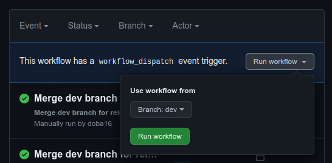

# TaleTime

Children may discover a novel way to listen to audiobooks with the help of the revolutionary Android and iOS software TaleTime.

In addition to offering parents the chance to record the stories themselves, we also provide professionally recorded audiobooks. Recording is incredibly practical and, naturally, is something that anyone with a little understanding of technology can perform. Children at TaleTime can also decide how the stories will develop on their own.

<!-- <div class="d-lg-none">
    <p class="lead">
        <a href="app">Test out our online demo!</a>
    </p>
</div> -->
*[Test out our online demo](https://taletime-2022.web.app/#/)*

## Write a new Story

TaleTime depends on authors producing new works! The information below is for you if you want to help grow the application.

To become a taletime story-teller, all you need is to register an account, create a 'story-teller' profile and start recording as many stories as you wish. 


## Contributing

Everyone may contribute to improving TaleTime as it is an open source project.
The entire source code is available on [GitHub](https://github.com/TaleTime/TaleTime_2/tree/main/taletime), where you can also learn more about contributing.

Please ensure that your code adheres to the same style as the existing codebase whether adding a new feature or resolving a problem, and make an effort to write your code as simply as you can.
Additionally, test your modifications before committing them, and only do so if they don't damage anything.
You must use English for commenting.

## Installation

### Flutter

Download current [Flutter Version](https://docs.flutter.dev/get-started/install) and follow the installation guide for your OS.
Here you will install Flutter and Android Studio, you will update your path Variable to use commands more easily inside the shell and configure your Android Emulator.
The process is well documented and the command "flutter doctor" helps you find and solve any problems you might encounter. 

#### Disclaimer

During installation on Windows it might be necessary to update the included dart, use "flutter pub upgrade --major-versions" if needed.
For any other encountered error you can use [Google](https://www.google.de/), the Flutter community is very active and helpful.

### IDE

#### Android Studio

We recommend using [Android Studio](https://developer.android.com/studio) because it is an integrated development environment for Android projects.
It comes with all tools required for developing and configuring your emulators.

While already being configured for Android projects, the IDE is still missing support for Flutter.
This can easily be added by installing the [Flutter Plugin] (https://plugins.jetbrains.com/plugin/9212-flutter).
You can also add the [Flutter Intl Plugin](https://plugins.jetbrains.com/plugin/13666-flutter-intl).

In order to open the project properly, import only the `taletime/` folder into Android Studio.
Otherwise the IDE might not correctly detect the flutter project.

#### Visual Studio Code

An alternative to Android Studio is [Visual Studio Code](https://code.visualstudio.com/).
It is a lightweight IDE which can be customized to your needs.
In addition to that the project is already configured to it and offers a few benefits.

##### Recommended Plugins
###### Code Spell Checker: streetsidesoftware.code-spell-checker
Offers spellchecking for English, other language packages can be downloaded aswell 
###### Markdown All in One: yzhang.markdown-all-in-one
All in one Markdown solution
###### Flutter: Dart-Code.flutter
Flutter Extension with Dart
###### Flutter Intl: localizely.flutter-intl
Flutter localization binding from .arb files with official Intl library
###### Gradle for Java: vscjava.vscode-gradle
Manage Gradle Projects, run Gradle tasks and provide better Gradle file authoring experience in VS Code
###### vscode-commandbar: gsppvo.vscode-commandbar
Visual Studio Code Command bar
###### Git Graph: mhutchie.git-graph
View a Git Graph of your repository, and perform Git actions from the graph.
###### GitLens - Git supercharged: eamodio.gitlens
Supercharge Git within VS Code — Visualize code authorship at a glance via Git blame annotations and CodeLens, seamlessly navigate and explore Git repositories, gain valuable insights via rich visualizations and powerful comparison commands, and so much more.

#### Selecting flavor

The app can be build in three different "variants".
These variants are called flavors.
Each flavor has a different app ID, so that they can be installed in parallel on each device.
These flavors are:

- `dev`: for local development. This is the flavor you should select for working on the app. App ID: `de.htwsaar.taletime.dev`
- `staging`: for testing new features. Only used by pipelines inside GitHub Actions. App ID: `de.htwsaar.taletime.staging`
- `prod`: Productive version. Ony built by GitHub Actions. App ID: `de.htwsaar.taletime`

As already mentioned, the only flavor you should use is `dev`.
You need to set this flavor in your run configuration.
On Android studio, this can be done under Edit run configurations:


When running via command line, specify the `--flavor` option:

```bash
# Run app
flutter run --flavor dev

# Build APK
flutter build apk --flavor dev
```

## Developing

Always open the "taletime" folder inside your IDE to make sure all cmds are working

### Internationalization

All messages visible to the user must be translated.

1. Add a new variable to all internationalization files (app_en.arb,...).
   Be sure to prefix translation which are only used on one side with the class name in CamelCase, this ensures at least some clearness in the internationalization files.
   
   Example: `"pageClass_pageTitle":"Title of or Page"`,
2. Run `flutter gen-l10n` to update your internationalization files.
   VsCode is configured to automatically update internationalization files on save.
   In VsCode you can use the commandbar button "Update l10n" manually.
3. Call `AppLocalizations.of(context)!.\<your_variable_name>` inside your class.
   It will automatically add `import 'internationalization/localizations_ext.dart';`.
   The `!` is needed to tell flutter that the variable won't be null.
   
   Example:  AppLocalizations.of(context)!.pageClass_pageTitle

## Current Features

### Login and Registration

- Create a new account
- Login to your account
- Reset password

### Profiles

- Create profiles
- Edit profiles
- Delete profiles

### Listener

- Search stories
- Listen to stories
- Add stories to favorites

### Storyteller

- Record a story
- Play your recorded story
- Upload / save your recorded story

### Settings

- Change language (English / German)
- Light and dark mode
- Change password

## Development workflow

To work efficiently in a software project, there are some rules you should follow:

### Branches

There are two central branches in the project.

- `main`: This branch contains the stable code that is used by the productive release.
  DO NOT commit to this branch or merge any changes into it.
  It is maintained by the [dedicated workflow](#automatic-creation-of-releases).
- `dev`: This branch is set to be the default branch of the repository.
  It contains the latest code that can be included in the next release.
  DO NOT commit to this branch directly. ONLY merge pull requests into this branch.

### Workflow

To develop a new feature or fix a bug follow these steps:

1. Create a new branch from the `dev` branch.
   You should name it properly, starting with `fix/` or `feature/` followed by a short but meaningful description of what you do.
2. Develop your feature or fix. Commit your code often, but not too often to that branch.
   Write a meaningful commit message. It is important that you follow [Conventional Commits](https://www.conventionalcommits.org/en/v1.0.0/)
   This is important for automatically figuring out the next version number.
   Valid change types are `chore`, `fix`, `feat`, `BREAKING CHANGE`.
3. When you are done, open a pull request.
   This pull request should target the `dev` branch again.
   Remember to write a concise description of what you have done.
4. Request a review of at least one of your team members.
5. Your colleague reviews your changes and gives feedback.
   He or she can approve your code or request changes.
6. There is a workflow that also runs tests and let you know if there are problems during compilation.
7. If your code was approved, you can merge the pull request.
   If changes were requested, fix them and go back to step 4.

After a few features, you can create a new release of the app.
See [Automatic creation of releases](#automatic-creation-of-releases).

DO NOT edit the version number of the app by hand.
It is maintained automatically.

### Issues

Use GitHub Issues to keep track of bugs you encounter or new features you want to implement.

There are templates for bug reports and feature requests.
When creating a new issue you can select the appropriate type.
Fill out the form and include all relevant information.
This helps to remember all relevant aspects and keep a consistent format.

If you open a pull request that resolves an issue, include a reference in its description.
You can do so by typing `closes #123` where 123 needs to be replaced by the actual number of the issue.
When merging this pull request, this issue will automatically closed.

### Dependabot

Dependabot is software from GitHub that checks your code for newer versions of dependencies.
If it finds something that needs to be updated, it will create a pull request to apply that newer version.
In our configuration, it will run its checks weakly.
If there are pull requests from dependabot, wait for the status checks to pass, and then merge the pull request.

After merging changes, dependabot recognises this and rebases itself to include the latest changes.
This is indicated by yellow warning signs in the description.
DO NOT touch this pull request while these warning signs are shown.

Don't panic, you do not need to know or change anything about dependabot.
Just profit from its work and merge its pull requests from time to time.

## Workflows

This project takes leverage of GitHub Actions for Continuous Integration and Continuous Deployment.
There are different workflows that complete different tasks.

Don't panic, the workflows are already set up and working.
You do have to know anything about the inner workings of them.
Just profit from what is is already there.

### Automated testing

Whenever a developer opens a pull request, the code is automatically tested and built to find possible bugs as soon as possible.
Those commit massages get a little icon in GitHub pull request screens depending on the outcome of the tests.
This can be a green checkmark if all tests succeed.
If there was a problem, this will be a red cross.
As long as the tests are still in progress, a yellow circle will be shown.

Clicking on that icon brings you to the logs of this pipeline.
In case there is an error you can see the details to be able to understand the problem.

Each test run also builds a staging version of the app.
This allows for quick installation and other team members can test you newly added features.

### Automatic creation of releases

The app is released using the GitHub release system.
After adding relevant features or bug fixes a new release should be created.
Releases do not need to be crafted by hand, there is a workflow for it!

To release the app, you only need to navigate to [GitHub Actions](https://github.com/TaleTime/TaleTime_2/actions/workflows/release-merge-version.yaml) and run the workflow.
For that, click the "Run workflow"-Dropdown, select `dev` as the branch and hit "Run workflow".



This workflow will increase the version number according to semantic versioning and merge the dev branch into the main branch.
After that, a new release is created using the commit on the main branch.
The release notes are generated automatically from the merged pull requests since the last release.
After that a new development version is created on the dev branch.

So DO NOT create releases manually, use the dedicated workflow!

### Assigning labels to pull requests

Each pull request is assigned labels depending on the type of change that it applies.
Every time a pull request is updated, a workflow will assign labels accordingly.

It is very important for this workflow that you use conventional commits.

## About us

This project is in active development by several students of [Hochschule für Technik und Wirtschaft des Saarlandes](http://www.htwsaar.de).

